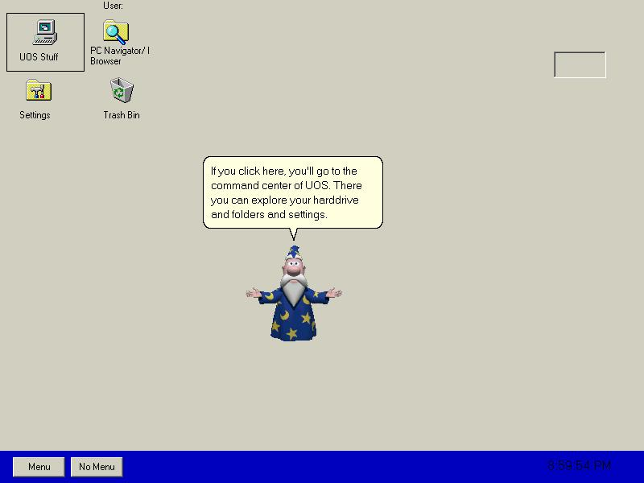



## UOS  Shell \(Ultimate Operating System\) 2003 \*\*Improved\!\*\*

### Description

UOS Shell 2003 Improved is better. I just improved it today. It now has help on the StartUp and I fixed spelling errors. MS Agent 2.0 is required. Please vote and send comments.
 
### More Info
 

             |
---                |---
**Submitted On**   |2002-11-09 09:01:12
**By**             |[Orly Leiva](https://github.com/Planet-Source-Code/PSCIndex/blob/master/ByAuthor/orly-leiva.md)
**Level**          |Advanced
**User Rating**    |2.3 (14 globes from 6 users)
**Compatibility**  |VB 5\.0, VB 6\.0
**Category**       |[Complete Applications](https://github.com/Planet-Source-Code/PSCIndex/blob/master/ByCategory/complete-applications__1-27.md)
**World**          |[Visual Basic](https://github.com/Planet-Source-Code/PSCIndex/blob/master/ByWorld/visual-basic.md)
**Archive File**   |[UOS\_\_Shell1494671192002\.zip](https://github.com/Planet-Source-Code/orly-leiva-uos-shell-ultimate-operating-system-2003-improved__1-40565/archive/master.zip)

